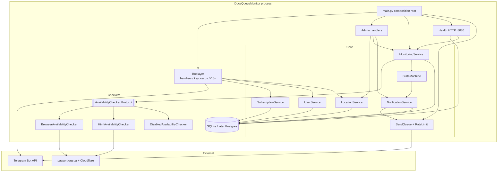
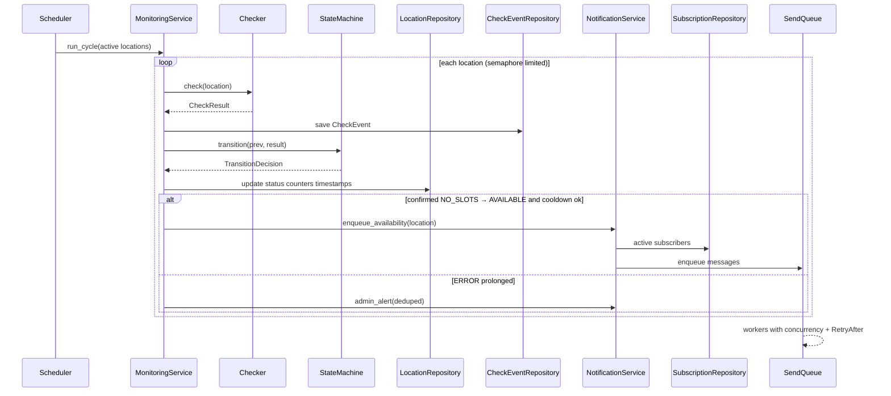
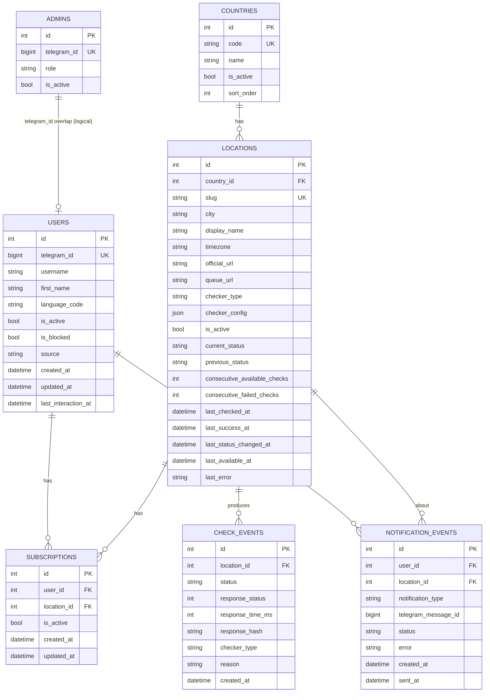
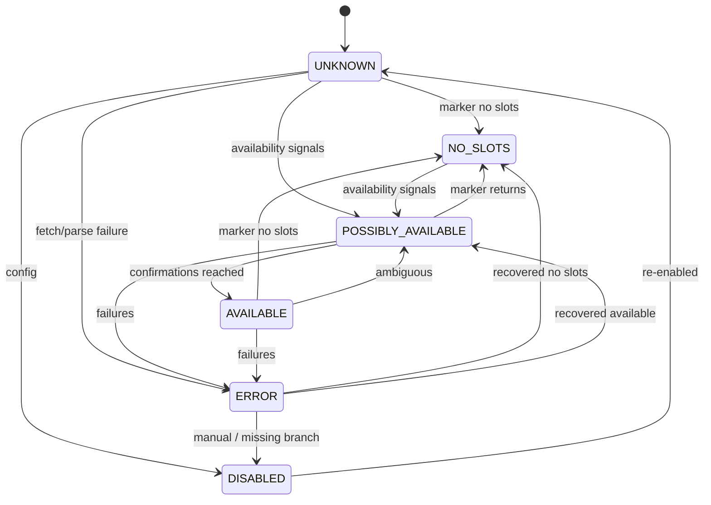
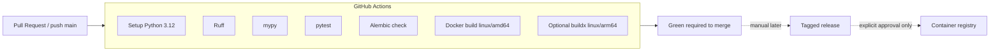

# DocsQueueMonitor — Architecture (Stage 1)

**Status:** Stage 1 foundation implemented (scaffold, models, migrations, seed, tests)  
**Date:** 2026-08-06  
**Scope decisions (confirmed):**

| Decision | Value |
|----------|--------|
| Project name | `DocsQueueMonitor` |
| MVP locations | Prague + 3 high-demand EU cities (proposed: Warsaw, Berlin, Kraków) |
| Geography UI | Minimized (Europe core only for v1) |
| Checker | Playwright primary; no Cloudflare bypass libraries |
| Host | Raspberry Pi 5 (8 GB), Debian 13 (trixie), ARM64 |
| Launch | Open from day one (careful rate limits) |
| License | MIT |
| DB (MVP) | SQLite → PostgreSQL-ready |
| Out of v1 UI | London, Toronto, Kortrijk (may remain in seed as inactive later) |

---

## 1. Directory structure

```text
DocsQueueMonitor/
├── .github/
│   ├── workflows/
│   │   ├── ci.yml                 # lint, typecheck, tests, migrations, docker build
│   │   └── docker.yml             # optional multi-arch buildx (ARM64+AMD64), no push without approval
│   └── dependabot.yml             # only after explicit approval
├── docker/
│   ├── Dockerfile                 # multi-stage, non-root, ARM64-friendly
│   ├── Dockerfile.playwright      # optional profile with Chromium
│   └── entrypoint.sh              # migrate + start
├── docs/
│   ├── architecture.md            # this file
│   ├── add-location.md            # (later) how to add a branch
│   ├── operations.md              # (later) backup/restore/update
│   └── monitoring-risks.md        # (later) CF, robots, legal notes
├── src/
│   └── app/
│       ├── __init__.py
│       ├── main.py                # composition root: bot + scheduler + health
│       ├── config.py              # Pydantic Settings
│       ├── logging.py             # JSON / console logging
│       ├── bot/
│       │   ├── handlers/          # thin UI handlers
│       │   ├── keyboards/
│       │   ├── middlewares/
│       │   ├── filters/
│       │   ├── texts/             # i18n dictionaries (uk/ru/en)
│       │   └── callbacks.py       # typed callback data schemas
│       ├── monitoring/
│       │   ├── scheduler.py       # asyncio loop, jitter, backoff, concurrency
│       │   ├── service.py         # orchestrates check → state machine → notify
│       │   ├── state_machine.py
│       │   ├── checkers/
│       │   │   ├── base.py        # AvailabilityChecker Protocol
│       │   │   ├── browser.py     # Playwright (primary)
│       │   │   ├── html.py        # HTTP+HTML after valid session (secondary)
│       │   │   ├── api.py         # reserved
│       │   │   └── disabled.py
│       │   └── parsers/
│       │       └── pasport_html.py
│       ├── notifications/
│       │   ├── service.py
│       │   ├── queue.py           # bounded async send queue
│       │   └── rate_limit.py
│       ├── locations/
│       │   ├── service.py
│       │   ├── seed.py
│       │   └── discovery.py       # optional future helpers
│       ├── subscriptions/
│       │   └── service.py
│       ├── users/
│       │   └── service.py         # privacy delete / anonymize
│       ├── database/
│       │   ├── models.py
│       │   ├── session.py
│       │   ├── repositories/
│       │   └── migrations/        # Alembic
│       ├── admin/
│       │   ├── handlers.py
│       │   └── service.py
│       ├── domain/
│       │   ├── enums.py
│       │   ├── entities.py
│       │   └── errors.py
│       └── health/
│           ├── checks.py
│           └── server.py          # minimal /health HTTP
├── tests/
│   ├── unit/
│   ├── integration/
│   └── fixtures/
│       └── html/                  # no_slots, available, captcha, broken, empty
├── scripts/
│   ├── backup.sh
│   ├── restore.sh
│   └── healthcheck.sh
├── data/                          # volume: sqlite + runtime (gitignored)
├── logs/                          # volume (gitignored)
├── .env.example
├── .gitignore
├── .pre-commit-config.yaml
├── alembic.ini
├── docker-compose.yml             # default: bot without heavy browser deps if possible
├── docker-compose.playwright.yml  # override/profile for browser checker
├── pyproject.toml                 # Python 3.12, ruff, mypy, pytest
├── LICENSE                        # MIT
├── README.md
├── README.uk.md
├── CONTRIBUTING.md
├── SECURITY.md
├── PRIVACY.md
├── DISCLAIMER.md
└── CODE_OF_CONDUCT.md
```

### Intentional deviations from the original sketch

| Change | Why |
|--------|-----|
| `subscriptions/`, `users/` services | Keep Telegram handlers thin; subscription/privacy logic is not monitoring |
| `docker/` + compose profiles | Playwright optional on Pi without forcing Chromium into every image |
| `health/server.py` | Explicit `/health` for Docker HEALTHCHECK |
| No Redis/Celery/Kafka | Unproven need; asyncio queue is enough for MVP |

---

## 2. Technology stack

| Layer | Choice |
|-------|--------|
| Language | Python 3.12 |
| Bot | aiogram 3 |
| Async runtime | asyncio |
| HTTP | httpx (async) for HTML checker / health probes |
| Browser | Playwright (optional dependency / compose profile) |
| HTML parse | BeautifulSoup4 + lxml |
| ORM | SQLAlchemy 2 (async) |
| Migrations | Alembic |
| DB MVP | SQLite via `aiosqlite` |
| DB later | PostgreSQL via `asyncpg` (same models) |
| Settings | Pydantic Settings |
| Logging | structlog or stdlib JSON |
| Tests | pytest, pytest-asyncio, respx / aioresponses |
| Quality | Ruff, mypy, pre-commit |
| Packaging | Docker, Docker Compose |
| CI | GitHub Actions |
| License | MIT |

**Not in MVP:** Redis, Celery, Kafka, Kubernetes, public stats web UI, Dependabot (until approved).

---

## 3. Component diagram



### Component responsibilities

| Component | Responsibility | Must not do |
|-----------|----------------|-------------|
| Bot handlers | UX, callbacks, i18n | HTTP to passport sites; booking |
| MonitoringService | One check per location per cycle | Per-user HTTP |
| Checkers | Produce `CheckResult` | Auth, CAPTCHA solve, booking |
| StateMachine | Status transitions + confirmation count | Send Telegram messages |
| NotificationService | Decide *whether* to notify | Bypass cooldown / spam |
| SendQueue | How to send safely | Unlimited `gather` |
| Repositories | Persistence | Business rules |

---

## 4. Service interactions



---

## 5. Database schema

### Enums

- `LocationStatus`: `UNKNOWN`, `NO_SLOTS`, `POSSIBLY_AVAILABLE`, `AVAILABLE`, `ERROR`, `DISABLED`
- `CheckerType`: `browser`, `html`, `api`, `disabled`
- `NotificationType`: `slots_available`, `admin_alert`, `broadcast`, `test`
- `NotificationStatus`: `pending`, `sent`, `failed`, `cancelled`
- `AdminRole`: `admin`, `operator`

### Tables (logical)

**users**

| Column | Type | Notes |
|--------|------|-------|
| id | PK | |
| telegram_id | BIGINT UNIQUE | |
| username | nullable | |
| first_name | nullable | |
| language_code | str | `uk`/`ru`/`en` |
| is_active | bool | |
| is_blocked | bool | bot blocked by user |
| source | nullable | registration source |
| created_at / updated_at / last_interaction_at | datetime | |

**countries**

| Column | Type | Notes |
|--------|------|-------|
| id | PK | |
| code | str UNIQUE | ISO-ish `CZ`, `PL`, `DE` |
| name | str | canonical; UI via i18n keys |
| is_active | bool | |
| sort_order | int | |

**locations**

| Column | Type | Notes |
|--------|------|-------|
| id | PK | |
| country_id | FK | |
| slug | str UNIQUE | `prague`, `warsaw`, … |
| city | str | |
| display_name | str | |
| timezone | str | IANA |
| official_url | str | |
| queue_url | str | |
| checker_type | enum | |
| checker_config | JSON | markers, timeouts, browser opts |
| is_active | bool | monitoring enabled |
| current_status / previous_status | enum | |
| consecutive_available_checks | int | |
| consecutive_failed_checks | int | |
| last_checked_at / last_success_at / last_status_changed_at / last_available_at | datetime nullable | |
| last_error | text nullable | safe reason |
| created_at / updated_at | datetime | |

**subscriptions**

| Column | Type | Notes |
|--------|------|-------|
| id | PK | |
| user_id | FK | |
| location_id | FK | |
| is_active | bool | |
| created_at / updated_at | datetime | |
| UNIQUE(user_id, location_id) | | |

**check_events**

| Column | Type | Notes |
|--------|------|-------|
| id | PK | |
| location_id | FK | |
| status | enum | |
| response_status | int nullable | |
| response_time_ms | int nullable | |
| response_hash | str nullable | normalized body hash |
| final_url | str nullable | |
| checker_type | enum | |
| reason | str nullable | short, non-PII |
| created_at | datetime | indexed |

**notification_events**

| Column | Type | Notes |
|--------|------|-------|
| id | PK | |
| user_id | FK nullable | null for pure admin system events if needed |
| location_id | FK nullable | |
| notification_type | enum | |
| telegram_message_id | nullable | |
| status | enum | |
| error | nullable | |
| created_at / sent_at | datetime | |

**admins**

| Column | Type | Notes |
|--------|------|-------|
| id | PK | |
| telegram_id | BIGINT UNIQUE | |
| role | enum | |
| is_active | bool | |

### Indexes (minimum)

- `subscriptions(user_id)`, `subscriptions(location_id)`, `subscriptions(location_id, is_active)`
- `check_events(location_id, created_at DESC)`
- `notification_events(user_id, created_at)`, `notification_events(status)` where pending
- `locations(is_active)`, `locations(country_id)`
- `users(telegram_id)` unique already

### Retention

- `DATA_RETENTION_DAYS=90` for `check_events` / old notifications (configurable purge job later).

---

## 6. ER diagram



---

## 7. Notification sequence (user-facing)

Confirmed transition only: **`NO_SLOTS → AVAILABLE`** after `AVAILABILITY_CONFIRMATIONS` (default 2) consecutive positive checks, subject to cooldown.

```mermaid
sequenceDiagram
  participant Site as Official e-queue page
  participant Mon as Monitoring
  participant SM as StateMachine
  participant Ntf as Notifications
  participant Q as SendQueue
  participant User as Telegram user

  Note over Mon,SM: previous = NO_SLOTS
  Mon->>Site: check #1
  Site-->>Mon: form visible / no "all slots taken"
  Mon->>SM: POSSIBLY_AVAILABLE (confirm=1)
  Note over SM: no user notify yet

  Mon->>Site: check #2
  Site-->>Mon: still available
  Mon->>SM: AVAILABLE (confirm=2)
  SM->>Ntf: fire slots_available
  Ntf->>Q: enqueue for each active subscriber
  Q->>User: alert + official URL button
  Note over Ntf: cooldown; no repeat until back to NO_SLOTS then AVAILABLE again

  Mon->>Site: later check
  Site-->>Mon: "Наразі всі місця зайняті"
  Mon->>SM: NO_SLOTS
  Note over SM: arm for next AVAILABLE cycle
```

### User message shape (conceptual)

- Title: possible slots (no guarantee)
- City, country, checked-at
- Confirmation note
- Buttons: open official queue / unsubscribe / status

### Anti-spam rules

- No notify on transient network errors
- Admin alerts for prolonged location failures (dedup + cooldown)
- Telegram `RetryAfter` respected; blocked users → `is_blocked` / deactivate
- Send concurrency capped (`TELEGRAM_SEND_CONCURRENCY`)

---

## 8. State machine (monitoring)



**Safety rule:** unknown / changed structure / CAPTCHA / empty body → `UNKNOWN` or `ERROR`, never `AVAILABLE`.

---

## 9. Docker

### Images

1. **`docsqueuemonitor:lite`** — bot + monitoring orchestration + HTML checker deps; no Chromium.
2. **`docsqueuemonitor:playwright`** — same + Playwright Chromium (MVP on Pi 5).

### Compose (conceptual)

```yaml
services:
  bot:
    build: …
    restart: unless-stopped
    env_file: .env
    user: non-root
    ports:
      - "127.0.0.1:8080:8080"   # health only, not public admin
    volumes:
      - ./data:/app/data
      - ./logs:/app/logs
    healthcheck:
      test: ["CMD", "python", "-m", "app.health.checks"]
      interval: 30s
      timeout: 10s
      retries: 3
```

### Runtime requirements (Pi 5)

- ARM64 image via `buildx`
- Shared single browser context for all location checks
- `MAX_CONCURRENT_CHECKS=1..2` default on Pi
- Persistent `data/` for SQLite; backup via `scripts/backup.sh`

### Security baseline

- Secrets only via env
- Non-root user
- No publishing registry images without approval
- Health binds to localhost by default

---

## 10. CI/CD



### Pipeline jobs (planned)

| Job | Purpose |
|-----|---------|
| `lint` | Ruff format/check |
| `typecheck` | mypy |
| `test` | unit + integration (mocked network) |
| `migrations` | `alembic upgrade head` on empty SQLite |
| `docker` | build image (amd64 always; arm64 via buildx when feasible) |

### Explicit non-goals until approved

- Auto-push to GHCR/Docker Hub
- Dependabot/Renovate
- Deploy-to-Pi from CI (Pi pulls/updates manually via ops docs)

---

## 11. MVP location seed (design)

| Slug | Country | City | Active in MVP | Rationale |
|------|---------|------|---------------|-----------|
| `prague` | CZ | Prague | yes | Reference + confirmed page semantics |
| `warsaw` | PL | Warsaw | yes | Largest PL hub / demand |
| `berlin` | DE | Berlin | yes | Major DE hub; same page pattern verified |
| `krakow` | PL | Kraków | yes | High PL demand secondary city |
| others | … | … | no (later) | Minimized geography |

> Exact “top 3 by people” can be adjusted before seed implementation if you prefer Bratislava/Wrocław over Kraków.

---

## 12. Configuration surface (planned `.env`)

```text
TELEGRAM_BOT_TOKEN=
ADMIN_TELEGRAM_IDS=
DATABASE_URL=sqlite+aiosqlite:///data/bot.db
DEFAULT_LANGUAGE=uk
MONITORING_ENABLED=true
MONITORING_INTERVAL_SECONDS=90
MONITORING_JITTER_SECONDS=30
AVAILABILITY_CONFIRMATIONS=2
REQUEST_TIMEOUT_SECONDS=45
MAX_CONCURRENT_CHECKS=2
NOTIFICATION_COOLDOWN_SECONDS=600
TELEGRAM_SEND_CONCURRENCY=5
LOG_LEVEL=INFO
LOG_FORMAT=json
DATA_RETENTION_DAYS=90
HEALTHCHECK_PORT=8080
PLAYWRIGHT_ENABLED=true
```

Open launch → slightly conservative defaults (90s interval, low concurrency).

---

## 13. Stage boundary

**Done in Stage 1 (this document):** directory plan, DB/ER, components, sequences, stack, Docker, CI/CD.

**Not done yet:** Python packages, migrations, bot code, checkers, Dockerfiles, GitHub repo, CI workflows.

**Next (when approved):** Stage 1 implementation — scaffold + config + models + Alembic + empty tests green — still without full monitoring/Telegram UX.
